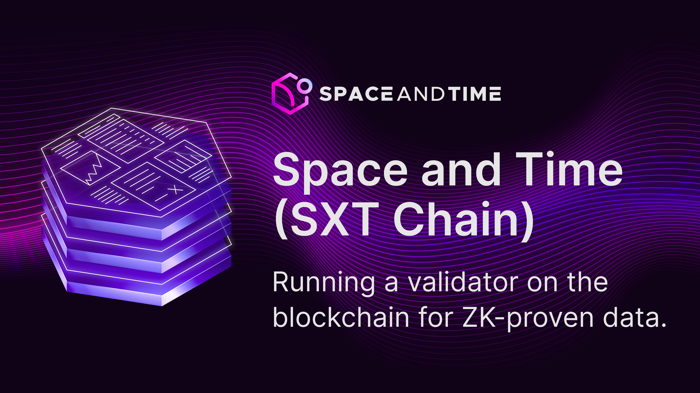
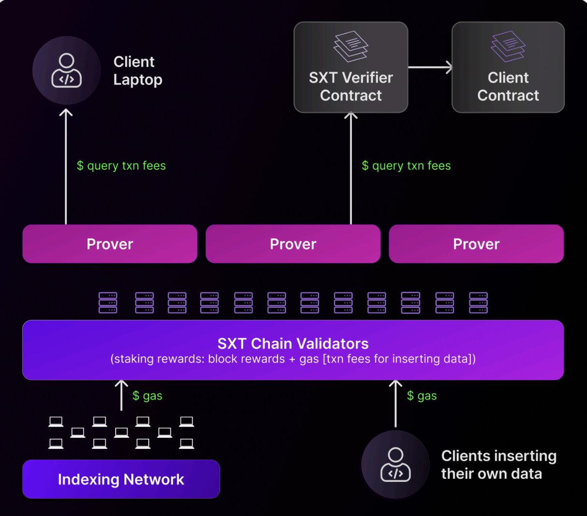

# **SXT Chain**

**SXT Chain** is the decentralized validator set for the Space and Time ecosystem, delivered as a decentralized database designed to scale tamperproof tables. It provides the trustless infrastructure for validating indexed blockchain and application data, ensuring cryptographic integrity and enabling sophisticated onchain applications powered by verifiable data.

Put simply, SXT Chain validators ensure inserts to tables are cryptographically tamperproof by witnessing the inserts. They come to BFT consensus, agreeing on the latest updated commitments for each table.

With SXT Chain, smart contracts can query and transact based not only on onchain data (transactions, blocks, smart contract events, storage slot changes, etc.) but also external datasets submitted by clients to SXT Chain. By combining tamperproof data with **Proof of SQL** (Space and Time’s sub-second ZK coprocessor) developers can build real-time, data-driven protocols that operate securely within block time.

SXT token utility is driven by the work of Space and Time’s validator set, where SXT “gas” is spent by clients of the chain to create and update tables. 

---

## **Validator Overview**

Validators are at the core of SXT Chain’s security and integrity. Validators witness (via BFT consensus) and validate offchain inserts or indexed data submitted by indexer nodes, agreeing on the latest cryptographic commitments that guarantee tamperproofness of all indexed tables.

As new rows are inserted into the chain, validators update these commitments and append them to each block, ensuring every table managed by SXT Chain is verifiably untampered. This mechanism allows SXT Chain to function as the trusted, decentralized database for crypto.

---

## **Data Integrity**

SXT Chain enforces **cryptographic data integrity** through a unique commitment scheme. Every table indexed into the network is represented by a cryptographic hash, updated as data evolves. This guarantees that:

* No indexed data can be modified or deleted without detection.

* Commitments are permanently anchored onchain as part of block history.

* These special cryptographic hashes (commitments) for each table are leveraged by the Proof of SQL protocol to ZK-prove that client queries are executed against these committed datasets… ensuring tamperproof query execution against tamperproof underlying tables.

---

## Detailed steps for Validator onboarding on each network
* [mainnet](docs/mainnet.md)
* [testnet](docs/testnet.md)
* [attestor](docs/attestor.md)
* [indexer](docs/indexer.md)

## For developers
If you would like to contribute to this repository, check out the [CONTRIBUTING.md](CONTRIBUTING.md) document.
