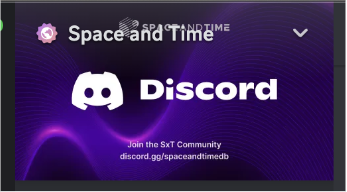
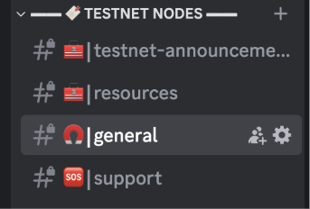
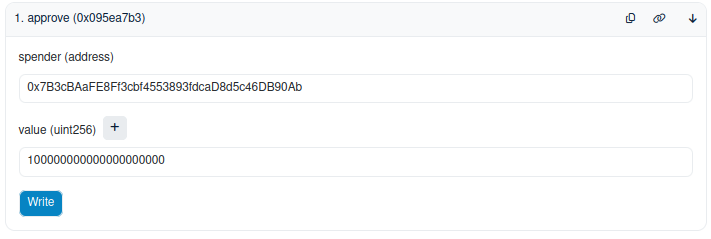
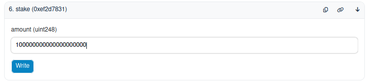

# SXT Chain Testnet Validator Setup Instructions

> [!IMPORTANT]
> If you were a validator in the original SXT Testnet, you will need to start a new validator from scratch using the instructions below.

## Noteworthy Mentions

> [!IMPORTANT]
> Traditionally Substrate networks rely on Substrate-compatible keys to register node operators and manage staking.
> The new Space and Time Testnet does not use Substrate keys. Stakers and Node operators will only use Ethereum keys in an Ethereum wallet.
> Stakers and node operators will use their Ethereum keys to interact with Space and Time's Staking and Messaging contracts. Transactions that take place in these contracts will then be reflected on-chain.

## I. Prerequisites

#### Request Testnet Tokens

- Send your Sepolia ETH address in an email to the sxt foundation.
  - NOTE: This must be different per validator that you are running
  - NOTE: To ensure that this is not a dead wallet, we will be checking that at least one transaciton has been submitted through this wallet

```yaml
  to: readiness@sxt.foundation
  subject: [NOP name] - Testnet Sepolia ETH Wallet Address
```

- The given address will receive 100 tokens which can be used to start staking

#### Incentives and Expectations

- **Participation Requirements**: Validators are expected to actively participate, with a response SLA of 48 hours for notifications around actions needed from validator operators, chain upgrades, changes to testing schedule, etc.
- **Incentive Structure**: We may choose to provide rewards to eligible Testnet participants for completing certain activities, including running nodes, performing other critical services related to the SxT Chain, and meeting certain performance criteria or other requirements. Additional details will be provided to you from time to time via Testnet-related websites and developer documentation.

**Discord information**: We have set up a Testnet Nodes channel in the [SXT Discord](https://discord.com/invite/spaceandtimeDB) to manage all communications and Q&A with node operators during testnet.





You will only be able to access this channel list if you hold the “Testnet Node Operator” role in the SXT Discord. Please share any team members’ Discord usernames with us directly via email at testnet@spaceandtime.io and we will assign this role to their profile(s).

### 1.1. System Specifications

The minimum system requirements for running a SXT validator node are shown in the table below:

| Key              | Value           |
| ---------------- | --------------- |
| CPU cores        | 16              |
| CPU Architecture | amd64           |
| Memory (GiB)     | 64              |
| Storage (GiB)    | 100             |
| Storage Type     | SSD             |
| OS               | Linux           |
| Network Speed    | 500Mbps up/down |

On Azure cloud, this is equivalent to SKU `Standard_D16as_v5` with storage SKU of `PremiumV2_SSD`.

### 1.2. Downloads

#### 1.2.1. Docker Image

Assuming Docker Desktop is installed and working on your computer. The SXT Node Docker image can be downloaded with `docker pull` command.

```bash
docker pull ghcr.io/spaceandtimefdn/sxt-node:mainnet-v1.33.1
docker images --digests ghcr.io/spaceandtimefdn/sxt-node:mainnet-v1.33.1
```

When each new docker image is released we will also be sharing the full `sha256` hash of the image. Please confirm that hash against the image pulled down by docker with an extra docker `images` argument `--digests` to make sure that you are pulling the right one.

> [!NOTE]
> Note: While the above references the `sxt-node:mainnet-v1.33.1` docker image, this will change; please reference the "Resources" channel in the Testnet Nodes section of the [SXT Discord](https://discord.gg/spaceandtimeDB) or this [GitHub repository](https://github.com/orgs/spaceandtimefdn/packages/container/package/sxt-node) for the latest docker image.

#### 1.2.2. Testnet Chainspecs

SXT testnet chainspecs are part of the docker images mentioned in [section 1.2.1](#121-docker-image). To inspect the chainspecs that come with the docker image, please run the following:

```bash
docker run -it --rm \
  --platform linux/amd64 \
  --entrypoint=bash ghcr.io/spaceandtimefdn/sxt-node:mainnet-v1.33.1 \
  -c "cat /opt/chainspecs/testnet-spec.json"
```

> [!NOTE]
> Note: While the above references the `sxt-node:mainnet-v1.33.1` docker image, this will change; please reference the "Resources" channel in the Testnet Nodes section of the [SXT Discord](https://discord.gg/spaceandtimeDB) or this [GitHub repository](https://github.com/orgs/spaceandtimefdn/packages/container/package/sxt-node) for the latest docker image.

### 1.3. Testnet Bootnodes

Bootnodes on SXT networks are trusted peers on the network that a new node will first connect to and find more peers to download blocks from. The three bootnodes listed below are hosted by Space and Time:

```
/dns/new-validator0.testnet.sxt.network/tcp/30333/p2p/12D3KooWFSan1dfyXvyJkGoTf3Jyk7pLmWJpHEMriSYSt5JoqmDB
/dns/new-validator1.testnet.sxt.network/tcp/30333/p2p/12D3KooWLcAKtSNC2fQM8SEPwsLSrNijfihQ7ENFdb3TpqS2WCas
/dns/new-validator2.testnet.sxt.network/tcp/30333/p2p/12D3KooWHEJSqiT9KGVdU3HC7dvodY2DG8E8cHoVkSevA4ZVaM2d
```

### 1.4. Node Keys

Because the SxT Chain relies on EVM contracts for staking, node operators will need an Ethereum wallet (or Sepolia for Testnet) to interact with the staking contracts. The wallet you're using should have at least 0.05 ETH for transaction fees on the networks.

> [!IMPORTANT]
> Traditionally Substrate networks rely on Substrate-compatible keys to register node operators and manage staking.
> The new Space and Time Testnet does not use Substrate keys. Stakers and Node operators will only use Ethereum keys in an Ethereum wallet.
> Stakers and node operators will use their Ethereum keys to interact with Space and Time's Staking and Messaging contracts. Transactions that take place in these contracts will then be reflected on-chain.

A validator node key is used to create a node's peer id in order to uniquely identify the node over the p2p network. We first create a docker named volume where we want to store the node-key, then mount it as the `/data` folder into the container and run the key generating command:

```bash
docker run -it --rm \
  --platform linux/amd64 \
  -v sxt-node-key:/data \
  --entrypoint=/usr/local/bin/sxt-node \
  ghcr.io/spaceandtimefdn/sxt-node:mainnet-v1.33.1 \
  key generate-node-key --chain /opt/chainspecs/testnet-spec.json --file /data/subkey.key
```

The generated key should now be in a file called `subkey.key` in the sxt-node-key volume. Note that from the command line output it should also show you the peer id of the node.

## II. Validator Setup Using Docker

Here we assume the setup uses the following volumes: `sxt-testnet-data` is the block storage volume and the volume where the generated node key is stored is `sxt-node-key`.

### 2.1. Snapshot Download and Extraction

When starting a new node, the initial syncing of blocks with the rest of the network can take multiple days.
To alleviate this, it is recommended to download and extract a snapshot of the `paritydb` database prior to booting your node.
It is recommended to only do this when starting a new node as the database of a running node runs the risk of having its block storage corrupted.
If you want to use snapshots on a running node, be sure to stop the node first.

Once you start your node from the snapshot, it will sync from the block at the tip of the snapshot to the most recent block.
Space and Time roughly publishes snapshots on a two-week cadence, so you should only have to sync up to 15 days worth of blocks with the rest of the network.

The date of the latest snapshot (in `YYYY-MM-DD` format) can be found at https://snapshots.testnet.sxt.network/latest.txt
The snapshot and checksum for the corresponding date can then be downloaded at the following URLs, respectively
(where `${DATE}` is once again in `YYYY-MM-DD` format).

```
https://snapshots.testnet.sxt.network/${DATE}/sxt-testnet.tar.gz
https://snapshots.testnet.sxt.network/${DATE}/sxt-testnet.sha1
```

Once downloaded, extract the contents of the archive onto the `<block-storage-volume-mount-path>/chains` directory.
In the [example below](#22-docker-run), the block storage volume is getting mounted onto `/data`, so you'd be extracting onto `/data/chains`.
The tarball contents, once extracted, should have the following directory structure:


A correct extraction of the tarball will have the following directory structure:


The following snippet downloads and extracts the snapshot as described above.
To use the snippet below, the following tools are required:

- [aria2](https://aria2.github.io/) (used to speed up the download using parallel workers)
- [curl](https://curl.se/)
- [tar](https://man7.org/linux/man-pages/man1/tar.1.html)
- [sha1sum](https://man7.org/linux/man-pages/man1/sha1sum.1.html)

Note that before the `sxt-testnet.tar.gz` archive gets deleted in the snippet below, you'll be required to have enough disk space
to host both the archive and the exploded directory, which roughly equates to 2.5TB. To get around this requirement, a separate
volume that gets temporarily mounted to download the snapshot is recommended. A streaming solution would likely be the most space efficient,
but it has not yet been developed.

```bash
set -euo pipefail
LATEST_DATE="$(curl -s https://snapshots.testnet.sxt.network/latest.txt)"
pushd /data  # Directory that will be mounted as the block storage volume in docker
aria2c -x 16 -s 16 "https://snapshots.testnet.sxt.network/${LATEST_DATE}/sxt-testnet.tar.gz"
curl -O "https://snapshots.testnet.sxt.network/${LATEST_DATE}/sxt-testnet.sha1"
sha1sum --check "sxt-testnet.sha1"
mkdir -p chains
tar xf sxt-testnet.tar.gz -C chains
rm -f sxt-testnet.tar.gz sxt-testnet.sha1
popd
```

### 2.2. Docker Run

Make sure to set VALIDATOR_NAME to make it easier to identify your node in the telemetry dashboard.

```bash
docker run -d --restart always \
  --platform linux/amd64 \
  -v sxt-testnet-data:/data \
  -v sxt-validator-key:/key \
  -v sxt-node-key:/node-key \
  -p 30333:30333/tcp \
  -p 9615:9615/tcp \
  -p 9944:9944/tcp \
  --env HYPER_KZG_PUBLIC_SETUP_DIRECTORY=/data \
  ghcr.io/spaceandtimefdn/sxt-node:mainnet-v1.33.1 \
  --base-path /data \
  --prometheus-port 9615 \
  --prometheus-external \
  --pool-limit 10240 \
  --pool-kbytes 1024000 \
  --chain /opt/chainspecs/testnet-spec.json \
  --keystore-path /key \
  --node-key-file /node-key/subkey.key \
  --bootnodes "/dns/new-validator0.testnet.sxt.network/tcp/30333/p2p/12D3KooWFSan1dfyXvyJkGoTf3Jyk7pLmWJpHEMriSYSt5JoqmDB" \
  --bootnodes "/dns/new-validator1.testnet.sxt.network/tcp/30333/p2p/12D3KooWLcAKtSNC2fQM8SEPwsLSrNijfihQ7ENFdb3TpqS2WCas" \
  --bootnodes "/dns/new-validator2.testnet.sxt.network/tcp/30333/p2p/12D3KooWHEJSqiT9KGVdU3HC7dvodY2DG8E8cHoVkSevA4ZVaM2d" \
  --database "paritydb" \
  --validator \
  --port 30333 \
  --log info \
  --telemetry-url 'wss://telemetry.polkadot.io/submit/ 5' \
  --sync fast \
  --no-private-ipv4 \
  --name ${VALIDATOR_NAME?}
```

### 2.3. Docker Compose

Prepare a `docker-compose.yaml` file as follows:

```yaml
---
name: "sxt-testnet-node"

services:
  sxt-testnet:
    platform: linux/amd64
    restart: unless-stopped
    image: ghcr.io/spaceandtimefdn/sxt-node:mainnet-v1.33.1
    ports:
      - "9615:9615" # metrics
      - "9944:9944" # rpc
      - "30333:30333" # p2p
    volumes:
      - sxt-testnet-data:/data
      - sxt-validator-key:/key
      - sxt-node-key:/node-key
    pid: host
    environment:
      HYPER_KZG_PUBLIC_SETUP_DIRECTORY: /data
    command: >
      --base-path /data
      --prometheus-port 9615
      --prometheus-external
      --pool-limit 10240
      --pool-kbytes 1024000
      --chain /opt/chainspecs/testnet-spec.json
      --keystore-path /key
      --node-key-file /node-key/subkey.key
      --bootnodes "/dns/new-validator0.testnet.sxt.network/tcp/30333/p2p/12D3KooWFSan1dfyXvyJkGoTf3Jyk7pLmWJpHEMriSYSt5JoqmDB"
      --bootnodes "/dns/new-validator1.testnet.sxt.network/tcp/30333/p2p/12D3KooWLcAKtSNC2fQM8SEPwsLSrNijfihQ7ENFdb3TpqS2WCas"
      --bootnodes "/dns/new-validator2.testnet.sxt.network/tcp/30333/p2p/12D3KooWHEJSqiT9KGVdU3HC7dvodY2DG8E8cHoVkSevA4ZVaM2d"
      --database paritydb
      --validator
      --port 30333
      --log info
      --telemetry-url 'wss://telemetry.polkadot.io/submit/ 5'
      --sync fast
      --no-private-ipv4

volumes:
  sxt-testnet-data:
    external: true
  sxt-validator-key:
    external: true
  sxt-node-key:
    external: true
```

and then start the sxt-testnet-node with command below:

```bash
docker compose -f ./docker-compose.yaml up -d
```

## III. SXT Chain Testnet: NPoS Staking Instructions

> [!NOTE]
> Please see the FAQ section at the end of this document if you have additional questions about onboarding as a validator

---

### Validators

Validators are the ones running the hardware that is creating blocks and participating in Consensus. Validators have their own stake in addition to anyone nominating them.

### Nominators

Nominators can allocate their stake towards an existing validator and participate in a portion of staking rewards without having to run their own hardware. In the event that a Validator is slashed for acting badly, the nominators will also be slashed. Nominators can nominate multiple validators.

### Eras

Every Era the elected set changes based on the distribution of stake from validators and nominators. Eras rotate every 24 hours.

### Epochs

Every Epoch new block slots are assigned to the previously elected validator set.

### Elections

Elections take place in the last block of the next-to-last Epoch. For example, SXT Chain has 24 Hour Eras consisting of six 4 hour long Epochs.
At the last block of Epoch 5 in each era, the election will take place and keys for the new validators will be queued to become active at the start of the next Era.

### Testnet Contract Addresses (Sepolia):

- **Testnet Staking Contract**
  [0x7B3cBAaFE8Ff3cbf4553893fdcaD8d5c46DB90Ab](https://sepolia.etherscan.io/address/0x7B3cBAaFE8Ff3cbf4553893fdcaD8d5c46DB90Ab#writeContract) (Staking)

- **Testnet Token Contract**
  [0xC768a8F94dcb61a200C9d9B2adbe50B41A80B839](https://sepolia.etherscan.io/token/0xC768a8F94dcb61a200C9d9B2adbe50B41A80B839#writeContract) (SpaceAndTime)

- **Testnet SessionKey Registration Contract**
  [0xc2159191D147A8BBD937b0BAbbFF2e47889841AC](https://sepolia.etherscan.io/address/0xc2159191D147A8BBD937b0BAbbFF2e47889841AC#writeContract) (SXTChainMessaging)

---

### Pre-Requisites

- Ethereum wallet with Sepolia ETH
- A minimum balance of **0.05 Sepolia ETH**
- Synced **SXT Chain validator node**

---

## Steps

### Step 1: Approve Token Spend

Send a transaction to the token contract to approve the staking contract to spend your test tokens:

- Go to SXT token contract address in etherscan: [0xC768a8F94dcb61a200C9d9B2adbe50B41A80B839](https://sepolia.etherscan.io/token/0xC768a8F94dcb61a200C9d9B2adbe50B41A80B839#writeContract) (SpaceAndTime)
- Select "write" button in this contract and connect with your Ethereum wallet (same wallet where you have your SXT tokens)
- Send an `approve` transaction with:
  - The **staking contract address** 0x7B3cBAaFE8Ff3cbf4553893fdcaD8d5c46DB90Ab (Staking)
  - The **token limit** to approve

  

---

### Step 2: Stake Tokens

Stake your desired amount using the **staking contract**. You must stake a minimum of 100 SXT or 100000000000000000000 units

- Go to Staking contract address in etherscan: [0x7B3cBAaFE8Ff3cbf4553893fdcaD8d5c46DB90Ab](https://sepolia.etherscan.io/address/0x7B3cBAaFE8Ff3cbf4553893fdcaD8d5c46DB90Ab#writeContract) (Staking)
- Select "write" button in this contract and connect with your Ethereum wallet (same wallet where you have your SXT tokens)
- Execute `stake` transaction:

  

---

## Validators Only

### Register Your Session Keys

Use the message transaction to submit your session keys.

Call `rotateKeys()` RPC on your node:

```bash
docker exec -ti $(docker ps -q -f volume=sxt-testnet-data) \
curl -X POST http://localhost:9944 \
  -H "Content-Type: application/json" \
  -d '{
    "jsonrpc": "2.0",
    "method": "author_rotateKeys",
    "params": [],
    "id": 1
  }'
```

You’ll receive a response like:

```json
{
  "jsonrpc": "2.0",
  "id": 1,
  "result": "0x3084486e870e12fc551eacc173291f0d75ac5fed823aeb1e158bc98db215936202a555f88490d19f7fbacac7078fc87886084efd8227187a73ad05aee6da8ad38edd8739daa5689e9e118eb3be0330bbf80a30ad7639d4f0d70970dbccff9c4a"
}
```

- Copy the `result` hex string.
- Go to SessionKey Registration Contract address in etherscan: [0xc2159191D147A8BBD937b0BAbbFF2e47889841AC](https://sepolia.etherscan.io/address/0xc2159191D147A8BBD937b0BAbbFF2e47889841AC#writeContract) (SXTChainMessaging)
- Paste the hex string into the `body` field of the **message transaction**.
- This also triggers `validate()` to activate your node.

  

NOTE: If you registered prior to September 2025, and your session keys changed, or you need to re-register for some other reason, you may need to migrate contracts:

<details>
<summary>
Session Key Registration Migration
</summary>

> The contract address has upgraded from `0x5FFDa3bd0D4aa3FC1C2CF83F34b0eF1d9D89A118` to `0xc2159191D147A8BBD937b0BAbbFF2e47889841AC`. In order to register properly, you need to sync the new contract. There are two options:
>
> 1. Use a new ethereum wallet for registration.
> 2. Send several dummy messages on the new contract.
>    - Call [`getNonce`](https://sepolia.etherscan.io/address/0x5FFDa3bd0D4aa3FC1C2CF83F34b0eF1d9D89A118#readContract#F1) on the old contract. Suppose the result is `5`.
>    - Call [`getNonce`](https://sepolia.etherscan.io/address/0xc2159191D147A8BBD937b0BAbbFF2e47889841AC#readContract#F1) on the new contract. Suppose the result is `1`.
>    - Take the difference between these nonces. In the example, the difference would be `4`.
>    - Call [`message`](https://sepolia.etherscan.io/address/0xc2159191D147A8BBD937b0BAbbFF2e47889841AC#writeContract#F2) on the new contract until the nonces match. In the example, it should be called 4 times. The body of the message can be anything. For simplicity, just use `0x`.

</details>

---

### Converting EVM Address to SS58 Format

If you need to derive the **SS58 validator address** from your Ethereum address (e.g., for nomination or validator verification), follow the steps below.

#### Step 1: Construct the Public Key Input

Prepend your Ethereum address with 24 leading zero bytes (48 hex characters: `0x000000000000000000000000`) so that the full length becomes 32 bytes.

For example, if your Ethereum address is:

```
0xXXXXXXXXXXXXXXXXXXXXXXXXXXXXXXXXXXXXXXXX
```

Then the corresponding 32-byte public key input is:

```
0x000000000000000000000000XXXXXXXXXXXXXXXXXXXXXXXXXXXXXXXXXXXXXXXX
```

#### Step 2: Inspect the Key Using `sxt-node`

Use the following Docker command to convert the 32-byte key into the SS58 address format used by the SXT Chain:

```bash
docker exec -it $(docker ps -q -f volume=sxt-testnet-data) /usr/local/bin/sxt-node key inspect --public 0x000000000000000000000000XXXXXXXXXXXXXXXXXXXXXXXXXXXXXXXXXXXXXXXX
```

You will receive output that includes the SS58 address:

```
SS58 Address: 5FhXXXXXXXXXXXXXXXXXXXXXXXXXXXXXXXXXXXXXXX
```

You can now use this address for validator nomination, monitoring, or other chain operations that require the Substrate-style SS58 format.

> **Note:** This conversion is deterministic and allows direct mapping from Ethereum keys to SXT Chain SS58 keys for interoperability between Ethereum-based staking and Substrate-based identity management.

---

## How to Nominate (Optional)

This is an optional step; in order to nominate someone, they must be an active validator. You can nominate validators by submitting their **hexadecimal** form of the wallet address as it appears on Substrate to the staking contract. This can be found from the validator list and then converted from SS58 to Hexadecimal.

In order to generate the hexadecimal value from the SS58 value, one can run the following commands:

```bash
SS58_KEY=<The SS58 public wallet address of the validator you want to nominate>
docker run -it --rm \
  --platform linux/amd64 \
  -v sxt-node-key:/data \
  --entrypoint=/usr/local/bin/sxt-node \
  ghcr.io/spaceandtimefdn/sxt-node:mainnet-v1.33.1 \
  key inspect $SS58_KEY
```

The SS58_KEY can be obtained from the address list of validators in the [Staking Dashboard](https://polkadot.js.org/apps/?rpc=wss://new-rpc.testnet.sxt.network/#/staking)

**You MUST use Hex format. Do NOT use SS58 format**:

❌ Invalid (SS58):
`5GrwvaEF5zXb26Fz9rcQpDWS57CtERHpNehXCPcNoHGKutQY`

✅ Valid (Hex):
`0xd43593c715fdd31c61141abd04a99fd6822c8558854ccde39a5684e7a56da27d`

You can enter **multiple nominations** like this:

```
[0x1234, 0x3456, 0x5678]
```


# FAQ (More Coming Soon)

## Do I need to nominate my own validator?

No you do not need to nominate yourself if you are a validator. Your validator node has its own stake tied to your account.

## Where do I get the address if I do want to nominate someone else's validator?

You can find the SS58 address of all available validators in the [Polkadot Explorer](https://polkadot.js.org/apps/?rpc=wss%3A%2F%2Fnew-rpc.testnet.sxt.network%2F#/explorer)
