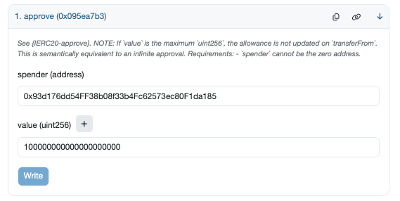
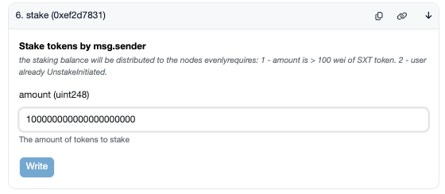

# SXT Chain Mainnet Validator Setup Instructions

## Introduction
### Launching SXT Chain – Background
#### Introduction to SXT Chain
* **Overview**: Space and Time (SXT) scales zero-knowledge (ZK) proofs on a decentralized data warehouse to deliver trustless data processing to smart contracts. You can use SXT to join comprehensive blockchain data we've indexed from major chains with apps’ data or other offchain datasets. Proof of SQL is SXT's sub-second ZK coprocessor, which allows smart contracts to ask complicated questions about activity on its own chain or other chains and get back a ZK-proven answer in the next block. SXT enables a new generation of smart contracts that can transact in real time based on both onchain data (like txns, blocks, smart contract events, storage slot changes, etc.) and data from apps, ultimately delivering a more robust onchain economy and more sophisticated onchain applications.
* **Validator activities**: The SXT Chain is designed to witness and validate indexed data submitted by indexer nodes. While the current mainnet phase only involves third-party validators (and not prover nodes quite yet), the SXT Chain ensures the integrity of data through cryptographic commitments—one special hash for each indexed table. As rows of data are inserted on the SXT Chain, the validators update these special hashes (commitments) and add them to each block. Ultimately, this proves/ensures that each table managed by the chain is cryptographically tamperproof.
* **Data Integrity**: As the SXT Chain indexes data, it generates cryptographic hashes (commitments) that guarantee the underlying data tables remain untampered. These commitments are essential for later phases, where our SXT Chain prover nodes will employ our Proof of SQL protocol to validate the integrity of the indexed data during ZK-proven SQL execution for client queries.

## Noteworthy Mentions
> [!IMPORTANT]
> Traditionally Substrate networks rely on Substrate-compatible keys to register node operators and manage staking.
> The new Space and Time Mainnet does not use Substrate keys. Stakers and Node operators will only use Ethereum keys in an Ethereum wallet.
> Stakers and node operators will use their Ethereum keys to interact with Space and Time's Staking and Messaging contracts. Transactions that take place in these contracts will then be reflected on-chain.

## I. Prerequisites

#### Mainnet Tokens
- You need at least 100 SXT in order to onboard a validator node.


### 1.1. System Specifications
The minimum system requirements for running a SXT validator node are shown in the table below:

| Key              | Value           |
|------------------|-----------------|
| CPU cores        | 16              |
| CPU Architecture | amd64           |
| Memory (GiB)     | 64              |
| Storage (GiB)    | 512             |
| Storage Type     | SSD             |
| OS               | Linux           |
| Network Speed    | 500Mbps up/down |

On Azure cloud, this is equivalent to SKU `Standard_D16as_v5` with storage SKU of `PremiumV2_SSD`.

### 1.2. Downloads
#### 1.2.1. Docker Image
Assuming Docker Desktop is installed and working on your computer. The SXT Node Docker image can be downloaded with `docker pull` command.

```bash
docker pull ghcr.io/spaceandtimefdn/sxt-node:mainnet-v0.114.5
docker images --digests ghcr.io/spaceandtimefdn/sxt-node:mainnet-v0.114.5
```

When each new docker image is released we will also be sharing the full `sha256` hash of the image. Please confirm that hash against the image pulled down by docker with an extra docker `images` argument `--digests` to make sure that you are pulling the right one.

#### 1.2.2. Mainnet Chainspecs
SXT mainnet chainspecs are part of the docker images mentioned in [section 1.2.1](#121-docker-image). To inspect the chainspecs that come with the docker image, please run the following:

```bash
docker run -it --rm \
  --platform linux/amd64 \
  --entrypoint=bash ghcr.io/spaceandtimefdn/sxt-node:mainnet-v0.114.5 \
  -c "cat /opt/chainspecs/mainnet-spec.json"
```

### 1.3. Mainnet Bootnodes
Bootnodes on SXT networks are trusted peers on the network that a new node will first connect to and find more peers to download blocks from. The three bootnodes listed below are hosted by Space and Time:

```
/dns/validator0.mainnet.sxt.network/tcp/30333/p2p/12D3KooWK4MUYTiz8H6gG98JwN3bT11keivvFLYjtwEv5sqhwkAt
/dns/validator1.mainnet.sxt.network/tcp/30333/p2p/12D3KooWF92asK6nd1DTo4Hng3ekGpV2UYW9mSXJaXqB9RKGtyFU
/dns/validator2.mainnet.sxt.network/tcp/30333/p2p/12D3KooWRdhvrmMziPGeLxB7jtbe7h5q54Qth8KWjoCPaLn9Hv4v
```
### 1.4. Node Keys
Because the SxT Chain relies on EVM contracts for staking, node operators will need an Ethereum wallet to interact with the staking contracts. The wallet you're using should have at least 0.05 ETH for transaction fees on the networks.

> [!IMPORTANT]
> Traditionally Substrate networks rely on Substrate-compatible keys to register node operators and manage staking.
> The new Space and Time Mainnet does not use Substrate keys. Stakers and Node operators will only use Ethereum keys in an Ethereum wallet.
> Stakers and node operators will use their Ethereum keys to interact with Space and Time's Staking and Messaging contracts. Transactions that take place in these contracts will then be reflected on-chain.

A validator node key is used to create a node's peer id in order to uniquely identify the node over the p2p network. We first create a docker named volume where we want to store the node-key, then mount it as the `/data` folder into the container and run the key generating command:

```bash
docker run -it --rm \
  --platform linux/amd64 \
  -v sxt-node-key:/data \
  --entrypoint=/usr/local/bin/sxt-node \
  ghcr.io/spaceandtimefdn/sxt-node:mainnet-v0.114.5 \
  key generate-node-key --chain /opt/chainspecs/mainnet-spec.json --file /data/subkey.key
```

The generated key should now be in a file called `subkey.key` in the sxt-node-key volume. Note that from the command line output it should also show you the peer id of the node.

## II. Validator Setup Using Docker

Here we assume the setup uses the following volumes: `sxt-mainnet-data` is the block storage volume and the volume where the generated node key is stored is `sxt-node-key`.

### 2.1. Docker Run

Make sure to set VALIDATOR_NAME to make it easier to identify your node in the telemetry dashboard.

```bash
docker run -d --restart always \
  --platform linux/amd64 \
  -v sxt-mainnet-data:/data \
  -v sxt-validator-key:/key \
  -v sxt-node-key:/node-key \
  -p 30333:30333/tcp \
  -p 9615:9615/tcp \
  -p 9944:9944/tcp \
  --env HYPER_KZG_PUBLIC_SETUP_DIRECTORY=/data \
  ghcr.io/spaceandtimefdn/sxt-node:mainnet-v0.114.5 \
  --base-path /data \
  --prometheus-port 9615 \
  --prometheus-external \
  --pool-limit 10240 \
  --pool-kbytes 1024000 \
  --chain /opt/chainspecs/mainnet-spec.json \
  --keystore-path /key \
  --node-key-file /node-key/subkey.key \
  --bootnodes "/dns/validator0.mainnet.sxt.network/tcp/30333/p2p/12D3KooWK4MUYTiz8H6gG98JwN3bT11keivvFLYjtwEv5sqhwkAt" \
  --bootnodes "/dns/validator1.mainnet.sxt.network/tcp/30333/p2p/12D3KooWF92asK6nd1DTo4Hng3ekGpV2UYW9mSXJaXqB9RKGtyFU" \
  --bootnodes "/dns/validator2.mainnet.sxt.network/tcp/30333/p2p/12D3KooWRdhvrmMziPGeLxB7jtbe7h5q54Qth8KWjoCPaLn9Hv4v" \
  --validator \
  --port 30333 \
  --log info \
  --telemetry-url 'wss://telemetry.polkadot.io/submit/ 5' \
  --no-private-ipv4 \
  --name ${VALIDATOR_NAME?}
```

### 2.2. Docker Compose
Prepare a `docker-compose.yaml` file as follows:

```yaml
---
name: 'sxt-mainnet-node'

services:
  sxt-mainnet:
    platform: linux/amd64
    restart: unless-stopped
    image: ghcr.io/spaceandtimefdn/sxt-node:mainnet-v0.114.5
    ports:
      - '9615:9615' # metrics
      - '9944:9944' # rpc
      - '30333:30333' # p2p
    volumes:
      - sxt-mainnet-data:/data
      - sxt-validator-key:/key
      - sxt-node-key:/node-key
    pid: host
    environment:
      HYPER_KZG_PUBLIC_SETUP_DIRECTORY: /data
    command: >
      --base-path /data
      --prometheus-port 9615
      --prometheus-external
      --pool-limit 10240
      --pool-kbytes 1024000
      --chain /opt/chainspecs/mainnet-spec.json
      --keystore-path /key
      --node-key-file /node-key/subkey.key
      --bootnodes "/dns/validator0.mainnet.sxt.network/tcp/30333/p2p/12D3KooWK4MUYTiz8H6gG98JwN3bT11keivvFLYjtwEv5sqhwkAt"
      --bootnodes "/dns/validator1.mainnet.sxt.network/tcp/30333/p2p/12D3KooWF92asK6nd1DTo4Hng3ekGpV2UYW9mSXJaXqB9RKGtyFU"
      --bootnodes "/dns/validator2.mainnet.sxt.network/tcp/30333/p2p/12D3KooWRdhvrmMziPGeLxB7jtbe7h5q54Qth8KWjoCPaLn9Hv4v"
      --validator
      --port 30333
      --log info
      --telemetry-url 'wss://telemetry.polkadot.io/submit/ 5'
      --no-private-ipv4

volumes:
  sxt-mainnet-data:
    external: true
  sxt-validator-key:
    external: true
  sxt-node-key:
    external: true
```

and then start the sxt-mainnet-node with command below:

```bash
docker compose -f ./docker-compose.yaml up -d
```

## III. SXT Chain Mainnet: NPoS Staking Instructions

> [!NOTE]
> Please see the FAQ section at the end of this document if you have additional questions about onboarding as a validator

---

### Validators
Validators are the ones running the hardware that is creating blocks and participating in Consensus. Validators have their own stake in addition to anyone nominating them.

### Nominators
Nominators can allocate their stake towards an existing validator and participate in a portion of staking rewards without having to run their own hardware. In the event that a Validator is slashed for acting badly, the nominators will also be slashed. Nominators can nominate multiple validators.

### Eras
Every Era the elected set changes based on the distribution of stake from validators and nominators. Eras rotate every 24 hours.

### Epochs
Every Epoch new block slots are assigned to the previously elected validator set.

### Elections
Elections take place in the last block of the next-to-last Epoch. For example, SXT Chain has 24 Hour Eras consisting of six 4 hour long Epochs.
At the last block of Epoch 5 in each era, the election will take place and keys for the new validators will be queued to become active at the start of the next Era.


### Mainnet Contract Addresses:

- **Mainnet Staking Contract**
  [0x93d176dd54FF38b08f33b4Fc62573ec80F1da185](https://etherscan.io/address/0x93d176dd54FF38b08f33b4Fc62573ec80F1da185#writeContract) (Staking)


- **Mainnet Token Contract**
  [0xE6Bfd33F52d82Ccb5b37E16D3dD81f9FFDAbB195](https://etherscan.io/token/0xE6Bfd33F52d82Ccb5b37E16D3dD81f9FFDAbB195#writeContract) (SpaceAndTime)

- **Mainnet SessionKey Registration Contract**
  [0x70106a3247542069a3ee1AF4D6988a5f34b31cE1](https://etherscan.io/address/0x70106a3247542069a3ee1AF4D6988a5f34b31cE1#writeContract) (SXTChainMessaging)

---

### Pre-Requisites

- Ethereum wallet with ETH
- A minimum balance of **0.05 ETH**
- Synced **SXT Chain validator node**
---

## Steps

### Step 1: Approve Token Spend
Send a transaction to the token contract to approve the staking contract to spend your tokens:
- Go to SXT token contract address in etherscan: [0xE6Bfd33F52d82Ccb5b37E16D3dD81f9FFDAbB195](https://etherscan.io/address/0xE6Bfd33F52d82Ccb5b37E16D3dD81f9FFDAbB195) (SpaceAndTime)
- Select "write" button in this contract and connect with your Ethereum wallet (same wallet where you have your SXT tokens)
- Send an `approve` transaction with:
  - The **staking contract address** 0x93d176dd54FF38b08f33b4Fc62573ec80F1da185 (Staking)
  - The **token limit** to approve

  
---

### Step 2: Stake Tokens
Stake your desired amount using the **staking contract**. You must stake a minimum of 100 SXT or 100000000000000000000 units
- Go to Staking contract address in etherscan: [0x93d176dd54FF38b08f33b4Fc62573ec80F1da185](https://etherscan.io/address/0x93d176dd54FF38b08f33b4Fc62573ec80F1da185) (Staking)
- Select "write" button in this contract and connect with your Ethereum wallet (same wallet where you have your SXT tokens)
- Execute `stake` transaction:

  
---

## Validators Only

### Register Your Session Keys

Use the message transaction to submit your session keys.

Call `rotateKeys()` RPC on your node:

```bash
docker exec -ti $(docker ps -q -f volume=sxt-mainnet-data) \
curl -X POST http://localhost:9944 \
  -H "Content-Type: application/json" \
  -d '{
    "jsonrpc": "2.0",
    "method": "author_rotateKeys",
    "params": [],
    "id": 1
  }'
```

You’ll receive a response like:

```json
{
  "jsonrpc": "2.0",
  "id": 1,
  "result": "0x3084486e870e12fc551eacc173291f0d75ac5fed823aeb1e158bc98db215936202a555f88490d19f7fbacac7078fc87886084efd8227187a73ad05aee6da8ad38edd8739daa5689e9e118eb3be0330bbf80a30ad7639d4f0d70970dbccff9c4a"
}
```

- Copy the `result` hex string.
- Paste it into the `body` field of the **message transaction**.
- This also triggers `validate()` to activate your node.

  

---
### Converting EVM Address to SS58 Format

If you need to derive the **SS58 validator address** from your Ethereum address (e.g., for nomination or validator verification), follow the steps below.

#### Step 1: Construct the Public Key Input

Prepend your Ethereum address with 24 leading zero bytes (48 hex characters: `0x000000000000000000000000`) so that the full length becomes 32 bytes.

For example, if your Ethereum address is:

```
0xXXXXXXXXXXXXXXXXXXXXXXXXXXXXXXXXXXXXXXXX
```

Then the corresponding 32-byte public key input is:

```
0x000000000000000000000000XXXXXXXXXXXXXXXXXXXXXXXXXXXXXXXXXXXXXXXX
```

#### Step 2: Inspect the Key Using `sxt-node`

Use the following Docker command to convert the 32-byte key into the SS58 address format used by the SXT Chain:

```bash
docker exec -it $(docker ps -q -f volume=sxt-mainnet-data) /usr/local/bin/sxt-node key inspect --public 0x000000000000000000000000XXXXXXXXXXXXXXXXXXXXXXXXXXXXXXXXXXXXXXXX
```

You will receive output that includes the SS58 address:

```
SS58 Address: 5FhXXXXXXXXXXXXXXXXXXXXXXXXXXXXXXXXXXXXXXX
```

You can now use this address for validator nomination, monitoring, or other chain operations that require the Substrate-style SS58 format.

> **Note:** This conversion is deterministic and allows direct mapping from Ethereum keys to SXT Chain SS58 keys for interoperability between Ethereum-based staking and Substrate-based identity management.
---

## How to Nominate (Optional)

This is an optional step; in order to nominate someone, they must be an active validator. You can nominate validators by submitting their **hexadecimal** form of the wallet address as it appears on Substrate to the staking contract. This can be found from the validator list and then converted from SS58 to Hexadecimal.

In order to generate the hexadecimal value from the SS58 value, one can run the following commands:

```bash
SS58_KEY=<The SS58 public wallet address of the validator you want to nominate>
docker run -it --rm \
  --platform linux/amd64 \
  -v sxt-node-key:/data \
  --entrypoint=/usr/local/bin/sxt-node \
  ghcr.io/spaceandtimefdn/sxt-node:mainnet-v0.114.5 \
  key inspect $SS58_KEY
```

The SS58_KEY can be obtained from the address list of validators in the [Staking Dashboard](https://polkadot.js.org/apps/?rpc=wss://new-rpc.mainnet.sxt.network/#/staking)

**You MUST use Hex format. Do NOT use SS58 format**:

❌ Invalid (SS58):
`5GrwvaEF5zXb26Fz9rcQpDWS57CtERHpNehXCPcNoHGKutQY`

✅ Valid (Hex):
`0xd43593c715fdd31c61141abd04a99fd6822c8558854ccde39a5684e7a56da27d`

You can enter **multiple nominations** like this:

```js
[0x1234, 0x3456, 0x5678]
```
  
---


# FAQ (More Coming Soon)

## Do I need to nominate my own validator?
No you do not need to nominate yourself if you are a validator. Your validator node has its own stake tied to your account.

## Where do I get the address if I do want to nominate someone else's validator?
You can find the SS58 address of all available validators in the [Polkadot Explorer](https://polkadot.js.org/apps/?rpc=wss%3A%2F%2Fnew-rpc.mainnet.sxt.network%2F#/explorer)
